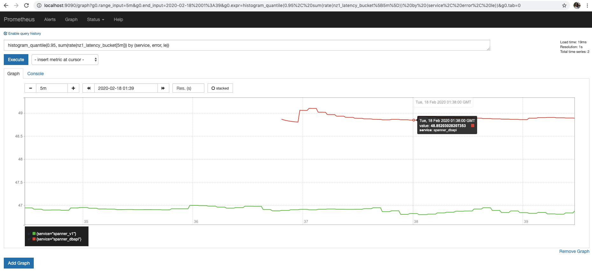
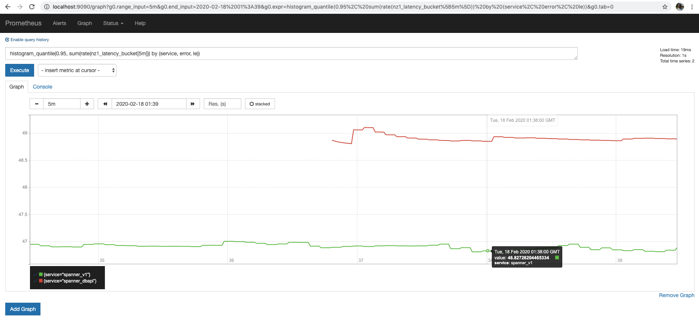

# spanner-benchmarking
Benchmarking utilities for Cloud Spanner tools

- [Requirements](#requirements)
- [Results](#results)

### Requirements

To get started, you'll need

- [ ] Spanner DBAPI and Spanner_v1 installed
- [ ] [OpenCensus Agent](https://opencensus.io/agent)
    - [ ] Enable any of the metrics exporters e.g. [Prometheus](https://opencensus.io/service/exporters/prometheus/)
- [ ] OpenCensus Python and OpenCensus-Ext-Ocagent installed
- [ ] 2 Cloud Spanner Tables with the following DDL statements
```sql
CREATE TABLE for_dbapi (
    name STRING(MAX) NOT NULL,
    age INT64,
) PRIMARY KEY (name)

CREATE TABLE for_spanner_v1 (
    name STRING(MAX) NOT NULL,
    age INT64,
) PRIMARY KEY (name)
```

### Results
For example, having used Prometheus as the metrics backend and apply a p95th aggregation with 
```shell
histogram_quantile(0.95, sum(rate(nz1_latency_bucket[5m])) by (service, error, le))
```

as of `Mon 17 Feb 2020 17:53:06 PST`, we get back a comparison that shows that the spanner.dbapi's
performance is worse than using spanner_v1, per

* spanner.dbapi p95th latency of 48.85203 ms


* spanner_v1 p95th latency of 46.82726 ms

